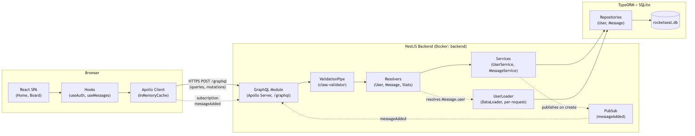
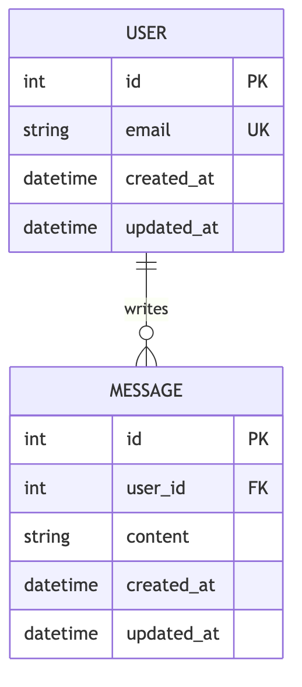

<h1 align="center">
GraphQL Message Board
</h1>

<p align="center">Full-stack GraphQL message board — NestJS backend, React frontend, running together as one system.</p>

## 🚀 Technologies

### Backend
- **NestJS** v10 — Node.js framework
- **GraphQL** v16 — Code-first schema with Apollo Server
- **TypeORM** v0.3 — TypeScript ORM (modern `DataSource` API)
- **SQLite** — Lightweight relational database, migrations run automatically on boot
- **DataLoader** — Per-request batch loading (N+1 prevention)
- **class-validator + class-transformer** — Input validation via `ValidationPipe`
- **TypeScript** v5, strict mode

### Frontend
- **React** v18 — UI library
- **Apollo Client** v3 — GraphQL client with `InMemoryCache`
- **React Router** v6 — Client-side routing
- **Styled Components** v6 — CSS-in-JS
- **TypeScript** v4.9, strict mode

## 📦 Installation

```bash
git clone https://github.com/luizcurti/nestjs-graphql.git
cd nestjs-graphql

cd back-end && npm install
cd ../front-end && npm install
```

## 🏃 Running the application

### Locally (two terminals)

```bash
# Terminal 1 — backend
cd back-end
npm run start:dev

# Terminal 2 — frontend
cd front-end
npm start
```

### With Docker Compose (recommended way to verify the full system)

```bash
docker compose up --build
```

This builds and starts both containers as one system:
- **Frontend**: http://localhost:3000
- **Backend API**: http://localhost:3333
- **GraphQL Playground**: http://localhost:3333/graphql (disabled when `NODE_ENV=production`)

The backend has a Docker healthcheck (`POST /graphql { __typename }`); the frontend container waits for it via `depends_on: condition: service_healthy`. Database migrations run automatically on boot, so a fresh `docker compose up` produces a fully working, empty database — no manual migration step needed. SQLite data persists in the `backend-data` named volume across restarts.

## 🏗️ Architecture

The backend follows a thin **Resolver → Service → Repository** layering: GraphQL resolvers only marshal arguments and delegate to `UserService` / `MessageService`, which own all business rules (email normalization, ownership checks, pagination) and talk to TypeORM repositories. This keeps each layer testable in isolation without introducing DDD/CQRS ceremony the app doesn't need. The frontend mirrors this with hooks (`useAuth`, `useMessages`) that own GraphQL calls and validation, leaving `Home`/`Board` as presentational components.





## 🔧 Features

- ✅ User create/login by email
- ✅ Full Message CRUD — `createMessage`, `updateMessage`, `deleteMessage` (owner-only)
- ✅ Full User CRUD — `updateUser`, `deleteUser`
- ✅ Paginated queries — `getUsers`, `getMessages`, `getMessagesFromUser` (page + limit)
- ✅ GraphQL queries, mutations, and subscriptions (`messageAdded`)
- ✅ DataLoader per request — zero N+1 queries
- ✅ Global `ValidationPipe` with `class-validator` decorators on every InputType
- ✅ Structured `GraphQLError` responses with `extensions.code` (NOT_FOUND, FORBIDDEN, BAD_USER_INPUT)
- ✅ CORS enabled — the SPA (port 3000) can actually call the API (port 3333) from a real browser
- ✅ `messages.user_id → users.id` foreign key with `ON DELETE CASCADE`, enforced at the database level
- ✅ Playground enabled only when `NODE_ENV !== 'production'`
- ✅ Fully typed with TypeScript end-to-end, strict mode on both sides

## 📁 Project Structure

```
.
├── back-end/               # NestJS GraphQL API
│   ├── src/
│   │   ├── config/         # TypeORM DataSource options + CLI datasource
│   │   ├── db/              # Entities, migrations, DataLoader
│   │   ├── services/        # UserService, MessageService — business logic
│   │   ├── resolvers/       # Thin GraphQL resolvers (input/types subfolders)
│   │   ├── common/          # paginate() helper
│   │   └── pubsub.ts         # shared PubSub instance (messageAdded)
│   ├── test/                # E2E tests (graphql.e2e-spec.ts)
│   ├── Dockerfile
│   └── data/                 # SQLite database (gitignored)
│
├── front-end/               # React application
│   ├── src/
│   │   ├── pages/            # Home, Board — presentational only
│   │   ├── hooks/            # useAuth, useMessages — GraphQL + logic
│   │   ├── graphql/           # gql documents + TS types
│   │   └── services/          # Apollo Client setup
│   └── Dockerfile
│
├── docs/
│   ├── mmd/                   # Mermaid diagram sources
│   ├── img/                   # Rendered diagrams (PNG)
│   └── postman/                # API collection (happy + sad paths)
│
├── e2e/                       # Playwright — real browser vs. real stack
│   └── tests/
│
├── docker-compose.yml
└── e2e-integration-test.sh     # Full-stack integration checks (curl)
```

## 🧪 Testing

The system is covered at five levels — unit, E2E, full-stack integration, an API collection, and real-browser E2E — each exercising both the happy and sad paths.

```bash
# Backend — unit tests (41 tests, 5 suites)
cd back-end && npm test

# Backend — E2E tests (34 tests, 1 suite)
cd back-end && npm run test:e2e

# Backend — coverage report
cd back-end && npm run test:cov

# Frontend — unit tests (16 tests, 4 suites)
cd front-end && npm test -- --watchAll=false

# Postman collection (27 requests / 78 assertions) — needs the backend running
cd back-end && npm run test:collection

# Full-stack integration (19 checks via curl) — needs both apps running
bash e2e-integration-test.sh

# Browser E2E (real Chromium vs. the real running stack) — needs docker compose up
cd e2e && npm install && npx playwright install --with-deps chromium && npm test
```

### Test coverage

| Suite | Type | Scope |
|---|---|---|
| `back-end/src/services/*.spec.ts` | Unit | `UserService`, `MessageService` business rules |
| `back-end/src/resolvers/*.spec.ts` | Unit | Resolver → service delegation |
| `back-end/test/graphql.e2e-spec.ts` | E2E | Every query/mutation, validation, ownership, malformed requests |
| `front-end/src/hooks/*.test.tsx` | Unit | `useAuth`, `useMessages` against a mocked Apollo Client |
| `front-end/src/pages/*/index.test.tsx` | Unit | `Home`, `Board` rendering + interaction |
| `docs/postman/*.postman_collection.json` | Collection | Every query/mutation, one happy + one sad request each |
| `e2e-integration-test.sh` | Integration | Front + back running together (routes, GraphQL, DataLoader, pagination, ownership) |
| `e2e/tests/full-stack.spec.ts` | Browser E2E | Real browser: type into the actual form, submit, confirm the backend stored it, confirm it renders back |

> **Why a separate browser layer?** Everything above either talks to the API directly (curl, supertest) or renders components against a *mocked* Apollo Client — none of them go through a real browser's network stack. The Playwright suite is what actually caught that the backend had no CORS policy: the real browser was silently blocking every request from the SPA to the API with `Failed to fetch`, invisible to every other test layer. It also caught a broken migration (see below). See [`e2e/README.md`](e2e/README.md).

**Bugs this pass found and fixed** (each only surfaced once the system was tested as a whole, not before): fresh databases had no tables (migrations were never run automatically, and the `typeorm` CLI script was broken for TypeORM 0.3); `getMessagesFromUser` threw under the real `ValidationPipe` config due to how NestJS merges multiple `@Args()` decorators; the backend had no CORS policy, so the real front-end couldn't reach it from a browser at all; and the `messages → users` foreign key was declared in a migration but never actually created, so deleting a user silently orphaned their messages instead of cascading.

## 📊 Documentation & diagrams

Mermaid sources live in [`docs/mmd/`](docs/mmd), rendered to PNG in [`docs/img/`](docs/img):

| Diagram | Purpose |
|---|---|
| [architecture.mmd](docs/mmd/architecture.mmd) | System components: SPA → Apollo Client → GraphQL API → services → DB |
| [er-diagram.mmd](docs/mmd/er-diagram.mmd) | `User` 1—N `Message` |
| [sequence-create-or-login-user.mmd](docs/mmd/sequence-create-or-login-user.mmd) | Login/register — happy + sad path |
| [sequence-create-message.mmd](docs/mmd/sequence-create-message.mmd) | Create message, DataLoader resolution, subscription publish |
| [sequence-delete-message.mmd](docs/mmd/sequence-delete-message.mmd) | Delete message — owner vs. forbidden |
| [docker-compose.mmd](docs/mmd/docker-compose.mmd) | Container/network/port layout |
| [ci-pipeline.mmd](docs/mmd/ci-pipeline.mmd) | GitHub Actions job graph |

## 🔄 CI

`.github/workflows/ci.yml` runs on every push/PR to `main` with four independent jobs: `back-end` (lint, build, unit, e2e), `front-end` (unit, build), `collection` (boots the API, runs the Postman collection via `newman`), and `integration` (`docker compose up`, runs `e2e-integration-test.sh` against the real containers, then the Playwright browser suite against the same running stack, tears down). See [ci-pipeline.mmd](docs/mmd/ci-pipeline.mmd).

## 📊 GraphQL Examples

### Queries
```graphql
query {
  getUsers(page: 1, limit: 20) {
    items { id email createdAt }
    total
    page
    pages
  }
}

query {
  getMessages(page: 1, limit: 20) {
    items { id content user { email } }
    total
    page
    pages
  }
}

query {
  getMessagesFromUser(userId: 1, page: 1, limit: 10) {
    items { id content }
    total
    pages
  }
}
```

### Mutations
```graphql
mutation { createOrLoginUser(data: { email: "user@example.com" }) { id email } }
mutation { updateUser(data: { id: 1, email: "new@example.com" }) { id email } }
mutation { deleteUser(data: { id: 1 }) { id } }
mutation { createMessage(data: { userId: 1, content: "Hello World!" }) { id content } }
mutation { updateMessage(data: { id: 1, userId: 1, content: "Updated content" }) { id content } }
mutation { deleteMessage(data: { id: 1, userId: 1 }) { id } }
```

### Subscriptions
```graphql
subscription {
  messageAdded { id content user { email } }
}
```

## 🛡️ Security notes

`npm audit` on both apps shows only dev-tooling vulnerabilities — transitive dependencies of `react-scripts` (front-end build tooling), `node-gyp`/`tar` (native module compilation for `sqlite3`), and `newman`/`handlebars` (CI-only collection runner) — none of them ship in the running application. Package versions were kept within their current major (no breaking upgrades); the one runtime-reachable advisory (a `react-router` open-redirect fix requiring a v7 major bump) was deliberately deferred for the same reason and noted here for visibility.

## 📚 Documentation

- [Backend README](./back-end/README.md)
- [Frontend README](./front-end/README.md)
- [Browser E2E README](./e2e/README.md)

## 🚀 Deployment

```bash
# Backend
cd back-end && npm run build && npm run start:prod

# Frontend
cd front-end && npm run build   # deploy the 'build' folder to any static host

# Or the whole system at once
docker compose up --build -d
```
